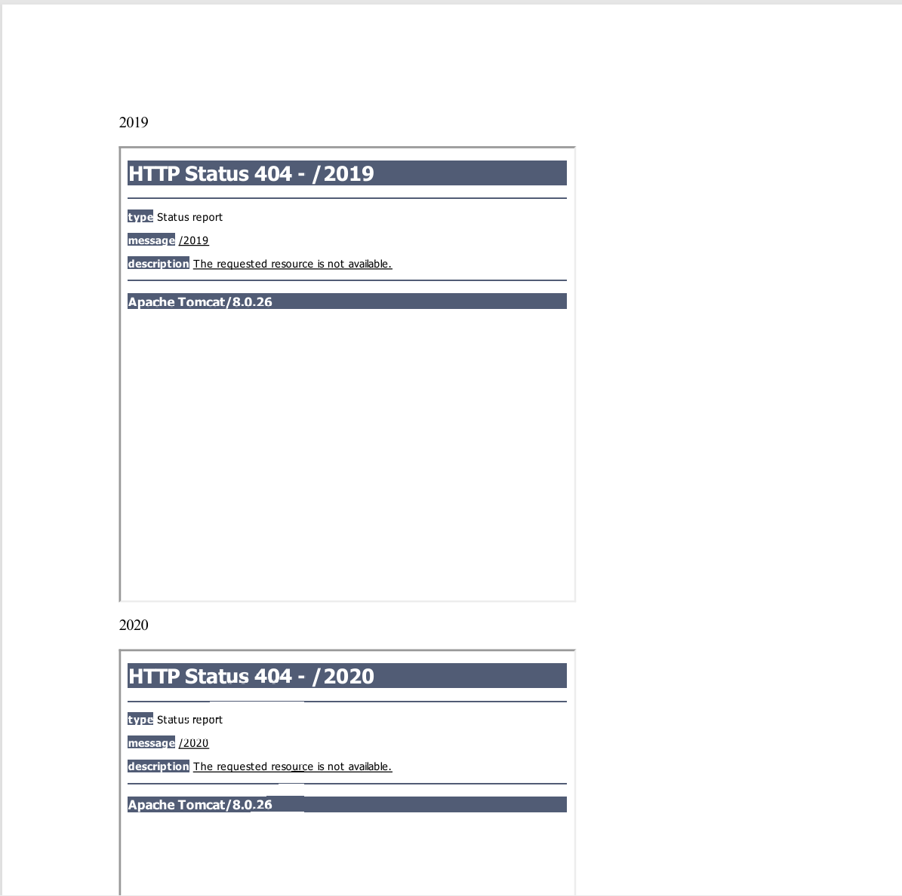

# PDF Generation SSRF Enum 📡

A simple tool I made to enumerate internal targets (web servers) on PDF SSRF.

## Example



## Features 💡

- Automatically sends requests to generate PDF's
- The downloaded PDF is parsed to detect active endpoints based on a regex (!=404)

## Usage

1. Change config.json

```
{
  "TARGET": "https://127.0.0.1", // Target of SSRF,
  "PDF_GEN_PATH": "/pdf/generate",
  "ENDPOINTS_PER_REQUEST": 10, //SSRF is done via iframe tags (<iframe>), how many do you want to include per request (more iframes is more efficient but might increase loading time)
  "BASELINE_LEN_THRESHOLD": "1500", //When not matching via USE_REGEX, a different in response length is used, this is the length threshold
  "USE_REGEX": true, // Use regex to match if an endpoint was discovered (got HTTP 200)
  "REGEX_NOT_FOUND": "404 Not Found" // Regex for 404, we check if we get a response that's different
}
```

2. Optionally fill in cookies.txt if authentication is needed.

3. Start the enumerator
   `python3 pdf-ssrf-enum.py`

4. PDF's get saved in /pdfs, the suffix -FOUND.pdf is added for PDF's that include a valid endpoint.

## Disclaimer

This tool is really simple and specific. It probably needs a bit of tweaking (mostly HTTP requests) to fit your needs.
